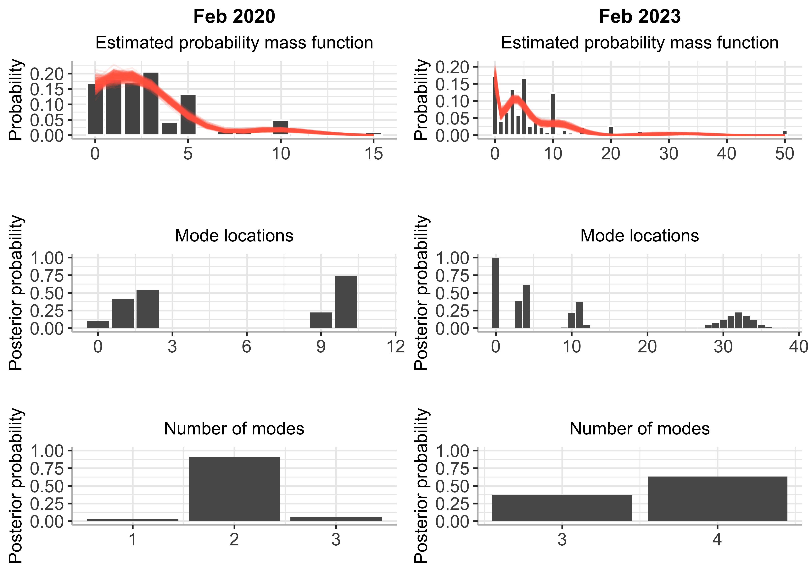
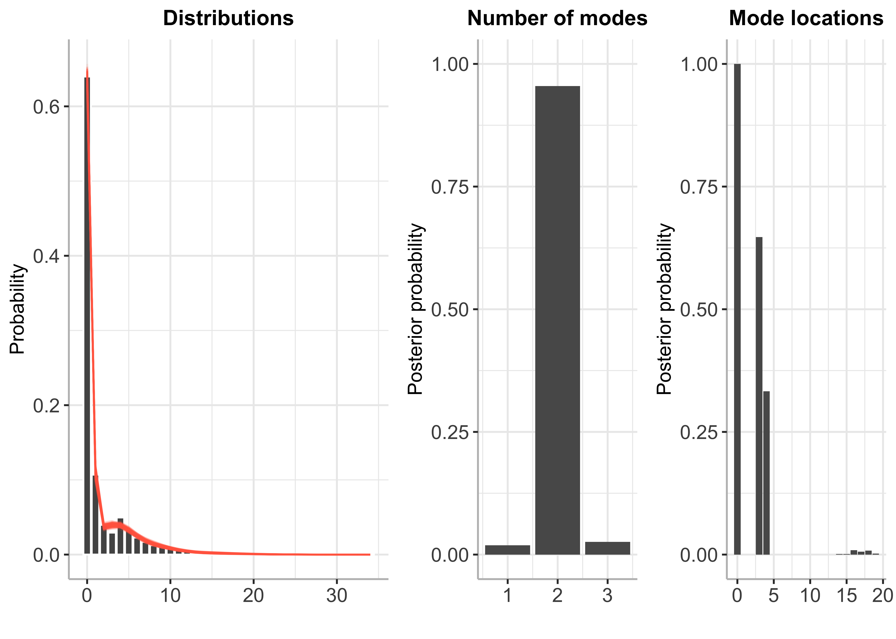

Bayesian mode inference for discrete distributions in economics and
finance
================

Replication code for J.L. Cross, L. Hoogerheide, P. Labonne and H.K. van
Dijk, Bayesian mode inference for discrete distributions in economics
and finance. *Economics Letters* (2024), doi:
<https://doi.org/10.1016/j.econlet.2024.111579>.

### Install the development version of BayesMultiMode

``` r
# install.packages("devtools") # if devtools not installed 
devtools::install_github("paullabonne/BayesMultiMode", quiet = T)
```

### Load packages

``` r
library(arrow) # to load parquet file
library(magrittr) # pipe
library(dplyr) 
library(tidyr)
library(zoo) # dates
library(BayesMultiMode)
library(multimode)
library(ggpubr)
library(ggplot2) 
```

``` r
set.seed(012)
```

#### Wrapper for unimodality tests

``` r
all_tests <- function(y, p1) {
  table_tests = c(modetest(y, method = "SI")$p.value,
                  modetest(y, method = "HY")$p.value,
                  modetest(y, method = "HH")$p.value,
                  p1)
  
  names(table_tests) = c("SI", "HY", "HH", "BMI")
  
  return(table_tests)
}
```

## inflation

### loading the data

``` r
raw_data = read_parquet("michigan_15_april_2023.parquet")

df_raw_data = raw_data %>%
  mutate(date = as.yearmon(as.character(YYYYMM),"%Y%m"),
         quarter = yearqtr(date),
         ID = as.character(ID)) %>%
  gather(-date,-ID,key="var",value="value") %>%
  filter(var %in% c("PX1","PX5", "RATEX", "UMEX"),
         date >= "Jan 2019")
```

### analysis

``` r
theme_p = theme(plot.title = element_text(),
                plot.subtitle= element_text(h = 0.5),
                plot.caption = element_text())

date1 = "Feb 2020"
date2 = "Feb 2023"

y1 = df_raw_data %>%
  filter(date==date1,
         var == "PX1",
         value >= 0,
         value < 95) %>%
  na.omit() %>%
  select(value) %>%
  unlist()

y2 = df_raw_data %>%
  filter(date==date2,
         var == "PX1",
         value >= 0,
         value < 95) %>%
  select(value) %>%
  unlist()

bmix = bayes_fit(y1, K = 5, dist = "shifted_poisson", print = F)
mode1 = bayes_mode(bmix)
g1 = plot(bmix) + 
  labs(title = date1, subtitle = "Estimated probability mass function") +
  theme_p

bmix = bayes_fit(y2, K = 5, dist = "shifted_poisson", print = F)
g2 = plot(bmix) +
  labs(title = date2, subtitle = "Estimated probability mass function") +
  theme_p

mode2 = bayes_mode(bmix)

ggarrange(g1, g2,
          plot(mode1, graphs = "loc") + labs(subtitle = "Mode locations") + ggtitle("") + theme_p,
          plot(mode2, graphs = "loc") + labs(subtitle = "Mode locations") + ggtitle("") + theme_p,
          plot(mode1, graphs = "number") + labs(subtitle = "Number of modes") + ggtitle("") + theme_p,
          plot(mode2, graphs = "number") + labs(subtitle = "Number of modes") + ggtitle("") + theme_p,
          ncol = 2,
          nrow = 3)
```

<!-- -->

``` r
tests1 = all_tests(y1, mode1$p1)
tests2 = all_tests(y2, mode2$p1)
print(rbind(tests1, tests2))
```

    ##           SI    HY    HH   BMI
    ## tests1 0.138 0.014 0.034 0.026
    ## tests2 0.240 0.008 0.000 0.000

## default data

### loading the data

``` r
x <- 0:34
freq.x <- c(3002, 502, 187, 138, 233, 160, 107, 80, 59, 53, 41, 28, 34, 10, 13, 11, 4, 5, 8, 6, 3, 0, 1, 0, 1, 0, 0, 0, 1, 1, 1, 1, 0, 0, 1) 

# create whole data
y <- rep(x[1], freq.x[1])

for(i in 1:34){
  tmp <- rep(x[i + 1], freq.x[i + 1])
  y <- c(y, tmp)
}
```

### analysis

``` r
mix = bayes_fit(y, dist = "shifted_poisson", K = 5)
```

    ## 10  % draws finished
    ## 20  % draws finished
    ## 30  % draws finished
    ## 40  % draws finished
    ## 50  % draws finished
    ## 60  % draws finished
    ## 70  % draws finished
    ## 80  % draws finished
    ## 90  % draws finished
    ## 100  % draws finished

``` r
p1 = plot(mix, max_size = 1000, transparency = 0.01) + ggtitle("Distributions")
modes = bayes_mode(mix)
p2 = plot(modes, graphs = c("number", "loc"))

summary(modes)
```

    ## The posterior probability of the data being multimodal is 0.981
    ## 
    ##  Number of estimated modes and their posterior probabilities:

    ##      Number of modes Posterior probabilty
    ## [1,]               1                0.019
    ## [2,]               2                0.955
    ## [3,]               3                0.026

``` r
ggarrange(p1, p2,
          common.legend = F,
          ncol = 2, nrow = 1,
          widths = c(0.8,1,1))
```

<!-- -->

``` r
tests_default = all_tests(y, modes$p1)
print(tests_default)
```

    ##    SI    HY    HH   BMI 
    ## 0.458 0.082 0.364 0.019
